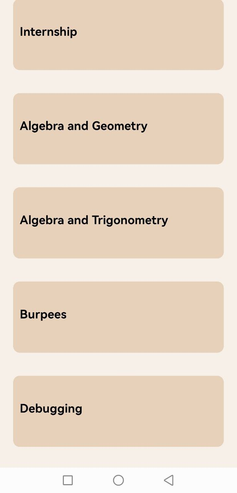
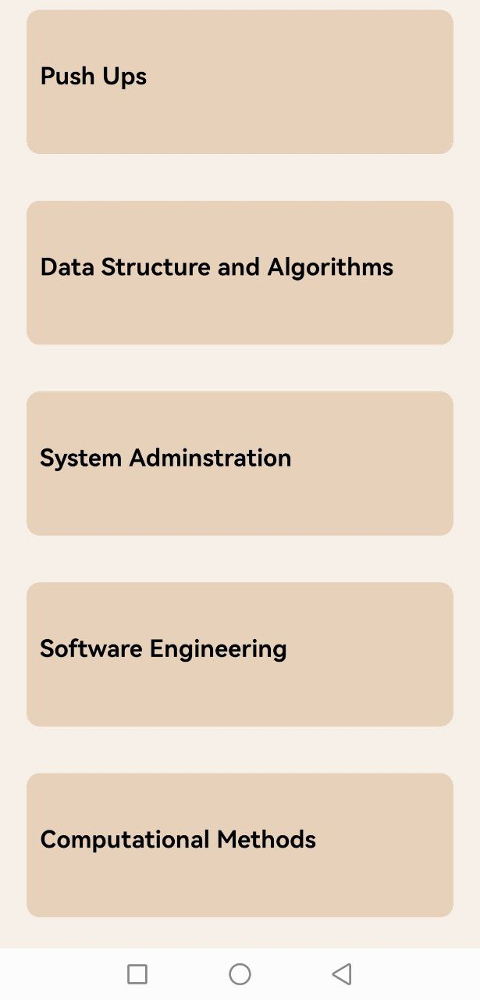

# rn-assignment3-11068463

## Functionality Description

1. **The Search Section**: This was achieved using the _TextInput_ tag. The required placeholder was included as well as the search icon. The filter functionality was achieved by wrapping the button image in a _TouchableOpacity_ tag.

2. **Categories**: This was achieved using a _FlatList_ set to allow horizontal scrolling.The contents of the card are mapped to the component from an array object.

3. **Ongoing Tasks**: This was achieved using a _FlatList_ set to allow scrolling. The contents of the card are mapped to the component from an array object.

## Project Images

